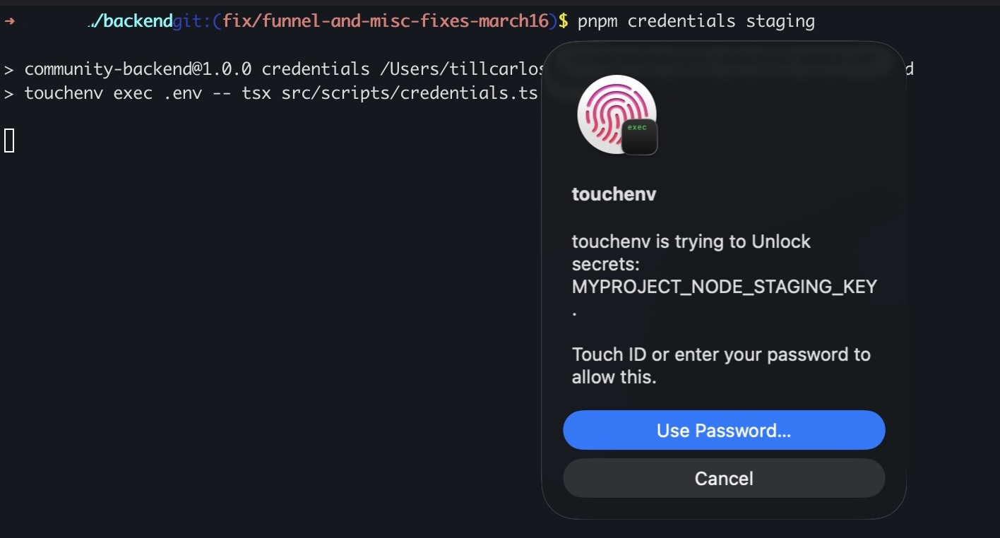
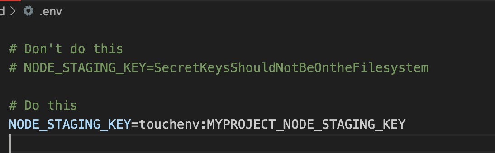
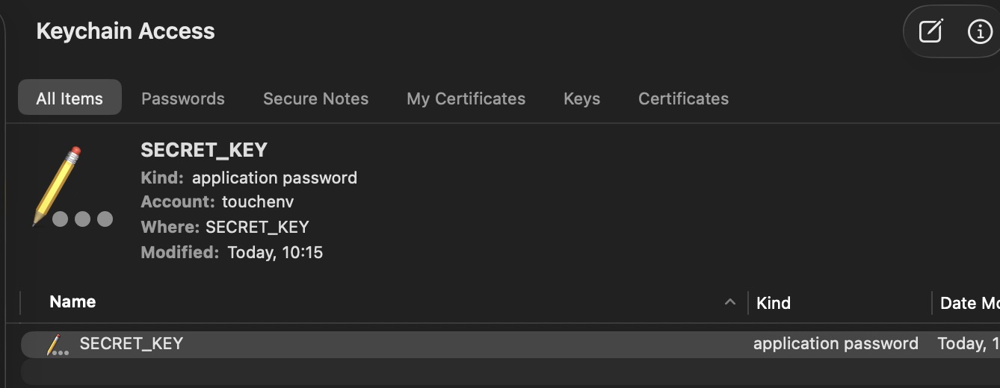

# touchenv

I had too many secret files in my .env locally. This became a problem.

We didn't want to use dotenvx as we only need one or two secrets stored. Dotenvx looked like overkill.

We use Rails encrypted credentials, so there's usually only one key to store safely. And only when editing the staging / production credentials.

That's why I made this repo, to store these keys in the Macos keychain. The touchid is required every time I use the key.

So it's also safe from the LLM to read:

This is how it looks:



Disclaimer: this is a quick tool I coded with Claude Code. I'm a CTO with 20 years of coding experience and a CS degree. I'll look into any concerns that get raised. Please file an issue or email me till@tillcarlos.com

Cool?

Then let's enter 🤖 land (everything below and the code)

## 🤖 Opus, take it away!

What this is about:

Store secrets in macOS Keychain. Unlock with Touch ID. Use them in `.env` files.

No plaintext keys in your repo. No extra services. Just your fingerprint.

## Install

```bash
git clone https://github.com/tillcarlos/touchenv.git
cd touchenv
```

It's a single Swift file. Read it first — you should never blindly install something that touches your Keychain:

```bash
claude "Is there ANYTHING I should worry about in this repo?"
```

Then install:

```bash
make install
```

## The problem

Secrets like API keys and deploy credentials end up as plaintext in `.env` files, shared over Slack, or committed to repos.

```bash
# Don't do this
NODE_STAGING_KEY=SecretKeysShouldNotBeOntheFilesystem
```

## The solution

Replace secret values with a `touchenv:` reference. The actual secret lives in macOS Keychain, protected by Touch ID.



```bash
# Do this
NODE_STAGING_KEY=touchenv:MYPROJECT_NODE_STAGING_KEY
```

## Usage

### Store a secret

```bash
touchenv store MY_SECRET
Enter value for 'MY_SECRET': ********
Stored 'MY_SECRET' in Keychain (Touch ID protected)
```

Or pipe it in:

```bash
echo "s3cret" | touchenv store MY_SECRET
```

### Run with secrets

Use `touchenv exec` to load a `.env` file, resolve all `touchenv:` references via a single Touch ID prompt, and run your command:

```bash
touchenv exec .env.staging -- bin/deploy.sh staging
```

One fingerprint tap unlocks all secrets and runs your command.

### npm scripts

```json
{
  "scripts": {
    "deploy:staging": "touchenv exec .env.staging -- bin/deploy.sh staging",
    "credentials:staging": "touchenv exec .env -- tsx src/scripts/credentials.ts staging"
  }
}
```

### Retrieve a single secret

```bash
touchenv get MY_SECRET   # Touch ID prompt → prints value to stdout
```

### All commands

```
touchenv store <key>                Store a secret (interactive prompt or pipe)
touchenv get <key>                  Retrieve a secret (Touch ID) → stdout
touchenv delete <key>               Remove from Keychain
touchenv list                       List stored keys
touchenv exec <envfile> -- <cmd>    Load .env, resolve touchenv: values, run cmd
```

## How it works

Secrets are stored in the macOS Keychain under the `touchenv` account, with `kSecAttrAccessibleWhenUnlockedThisDeviceOnly` (no iCloud sync, device-only).



- `touchenv get` and `touchenv exec` require Touch ID (via `LAContext`) before reading any secret
- Other apps accessing the same Keychain item get a system password prompt
- 194KB universal binary (arm64 + x86_64), no dependencies

## Onboarding new devs

1. Clone and install touchenv
2. Store the required secrets:
   ```bash
   touchenv store MY_NODE_KEY
   touchenv store MY_REGISTRY_PASSWORD
   ```
3. Add `touchenv exec .env -- ` before your command wherever you need secrets:
   ```json
   "deploy:staging": "touchenv exec .env.staging -- bin/deploy.sh staging"
   ```
4. Run as usual: `pnpm deploy:staging`

If a secret is missing, touchenv tells them exactly what to do:

```
Error: 'MY_NODE_KEY' not found in Keychain
  Run: touchenv store MY_NODE_KEY
```

## Requirements

- macOS 12+
- Touch ID (or Apple Watch unlock)
- Swift 5.9+ (for building from source)

## License

MIT
